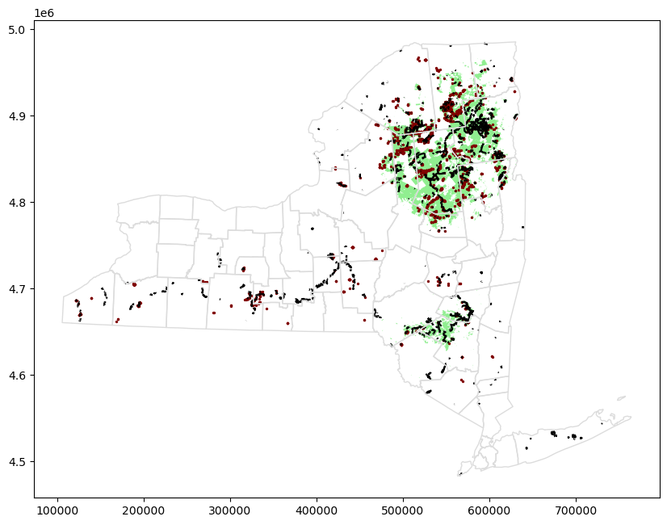

# Your First Map

El primer paso para leer datos geoespaciales es importar la libreria `GeoPandas`

```python
import geopandas as gpd
```

Existen diferentes tipos de archivos geoespaciales como
- shapefile (Es el más común)
- GeoJSON
- KML
- GPKG

Para importar los datos se hace de la siguiente manera
```python
full_data = gpd.read_file("../input/geospatial-learn-course-data/DEC_lands/DEC_lands/DEC_lands.shp")

full_data.head()
```

Como no queremos usar todas las columnas podemos seleccionar las que nos interesan

```python
data = full_data.loc[:, ["CLASS", "COUNTRY", "geometry"]].copy()
```

Para saber cuantos tipos de lands hay en el dataset
```python
data.CLASS.value_counts()
```

Para seleccionar las tierras que son "Wild Forest" o "Wilderness"

```python
wild_lands = data.loc[data.CLASS.isin(['WILD FOREST', 'WILDERNESS'])].copy()
wild_lands.head()
```

Para poder visualizar los datos
```python
wild_lands.plot()
```

Cada GeoDataFrame contiene una columna "geometry" que contiene los objetos geometricos para mostrar, estos suelen ser **Point**, **LineString**, **Polygon**.
Un ejemplo de como usarlos
```python
# Campsites in New York state (Point)
POI_data = gpd.read_file("../input/geospatial-learn-course-data/DEC_pointsinterest/DEC_pointsinterest/Decptsofinterest.shp")
campsites = POI_data.loc[POI_data.ASSET=='PRIMITIVE CAMPSITE'].copy()

# Foot trails in New York state (LineString)
roads_trails = gpd.read_file("../input/geospatial-learn-course-data/DEC_roadstrails/DEC_roadstrails/Decroadstrails.shp")
trails = roads_trails.loc[roads_trails.ASSET=='FOOT TRAIL'].copy()

# County boundaries in New York state (Polygon)
counties = gpd.read_file("../input/geospatial-learn-course-data/NY_county_boundaries/NY_county_boundaries/NY_county_boundaries.shp")
```

Luego creamos el mapa con los datos anteriores
```python
# Define a base map with county boundaries
ax = counties.plot(figsize=(10,10), color='none', edgecolor='gainsboro', zorder=3)

# Add wild lands, campsites, and foot trails to the base map
wild_lands.plot(color='lightgreen', ax=ax)
campsites.plot(color='maroon', markersize=2, ax=ax)
trails.plot(color='black', markersize=1, ax=ax)
```

Nos da como resultado
