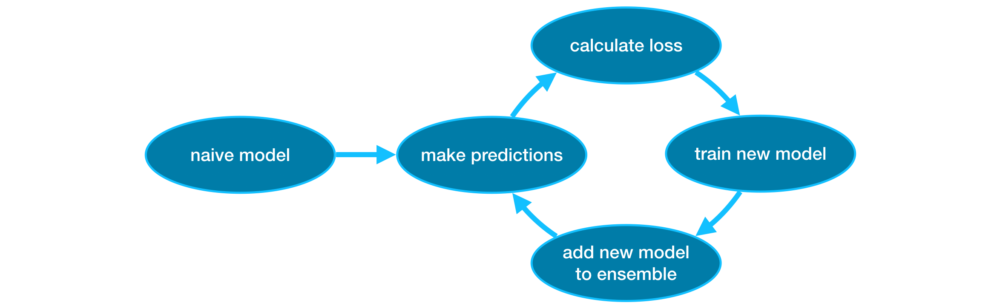

# XGBoost

## Gradient Boosting


```python
from xgboost import XGBRegressor

my_model = XGBRegressor()
my_model.fit(X_train, y_train)
```

```python
from sklearn.metrics import mean_absolute_error

predictions = my_model.predict(X_valid)
```

## Parameter Tunning
Los estimadores son un parametro que puede afectar drasticamente la precisión, suelen estar entre 100 y 1000

```python
my_model = XGBRegressor(n_estimators = 500)
my_model.fit(X_train, y_train)
```

Los **early stopping rounds** nos ayudan a parar antes, estos sucede cuando despues de n iteraciones ya no hay cambios tan importantes
```python
my_model = XGBRegressor(n_estimators =500)
my_model.fit(X_train, y_train,
            early_stopping_rounds = 5,
            eval_set = [(X_valid, y_valid)], 
            verbose = False)
```

**Learning rate**
```python
my_model = XGBRegressor(n_estimators=1000, learning_rate=0.05)
my_model.fit(X_train, y_train, 
             early_stopping_rounds=5, 
             eval_set=[(X_valid, y_valid)], 
             verbose=False)
```

**n_jobs**
```python
my_model = XGBRegressor(n_estimators=1000, learning_rate=0.05, n_jobs=4)
my_model.fit(X_train, y_train, 
             early_stopping_rounds=5, 
             eval_set=[(X_valid, y_valid)], 
             verbose=False)
```
